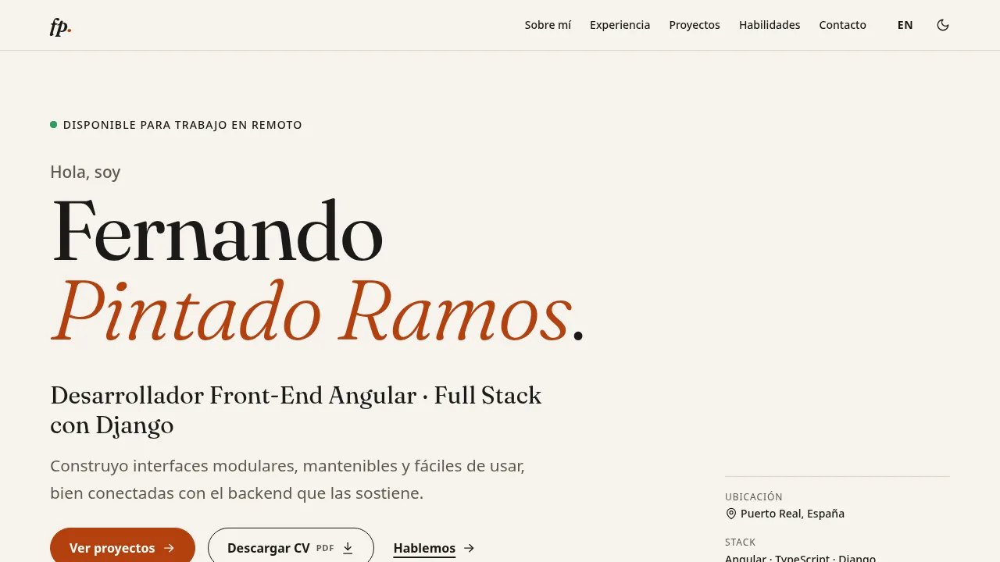
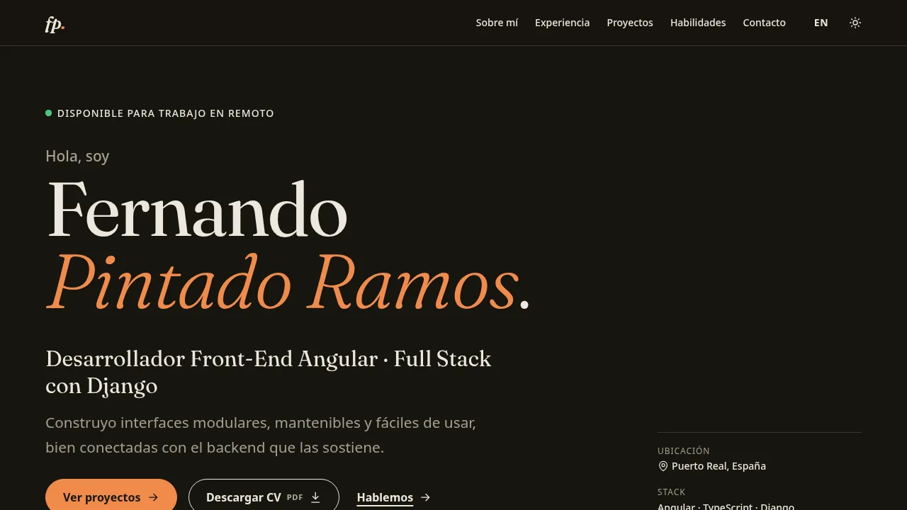
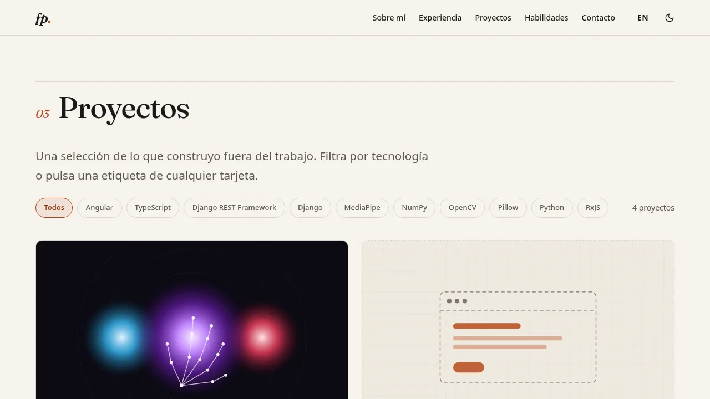
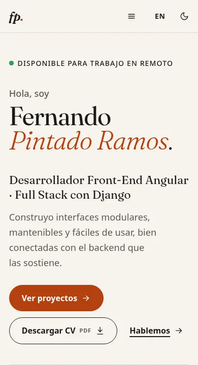
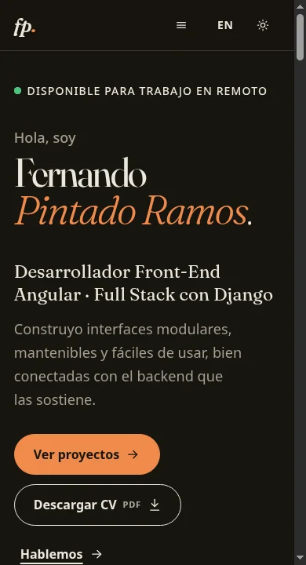

# fernandopinra.github.io

Portfolio personal de **Fernando Pintado Ramos**, desarrollador Front-End Angular con perfil full stack en Django.

🔗 **https://fernandopinra.github.io** · 🇬🇧 [English version](https://fernandopinra.github.io/en/)

Además de ser mi web, es una muestra de cómo trabajo con Angular moderno: componentes standalone, signals, zoneless, prerender e hidratación incremental, sin librerías de UI.

| Claro                                                                        | Oscuro                                                    |
| ---------------------------------------------------------------------------- | --------------------------------------------------------- |
|                       |    |
|  |  |

<p align="center">
  
  
</p>

## Stack

- **Angular 22** (CLI): standalone, `OnPush`, zoneless, nuevo control flow (`@if`, `@for`, `@let`, `@defer`).
- **SSG**: `outputMode: "static"`. Todas las rutas se prerenderizan a HTML en el build.
- **SCSS** con variables CSS para el tema. Sin frameworks de UI.
- **TypeScript strict**, `strictTemplates`, ESLint (angular-eslint + typescript-eslint strict) y Prettier.
- **Vitest** (runner por defecto de la CLI) para tests unitarios y **Cypress** para e2e.
- **GitHub Actions** → GitHub Pages con `actions/deploy-pages`.

## Decisiones técnicas

**Un build, dos idiomas, todo estático.** El español vive en `/` y el inglés en `/en`. Ambos se prerenderizan desde el mismo build, así que Google indexa las dos versiones (con `hreflang` y `canonical`) y GitHub Pages solo sirve ficheros. Descarté `@angular/localize` porque obliga a un build por idioma.

**i18n propio con signals** (`core/i18n`). `I18nService` guarda el idioma activo en un `signal` y expone `t()` y `loc()`, que se pueden llamar desde las plantillas:

- `t('hero.ctaCv')` traduce textos de interfaz. Las claves están tipadas a partir de `es.json` con un template literal type, así que una clave mal escrita es un error de compilación.
- `loc(project.summary)` elige el idioma de un contenido `{ es, en }`.

El español va en el bundle principal y el inglés se descarga bajo demanda (`import()` de un JSON, menos de 1 kB). Un resolver activa el idioma antes de renderizar cada ruta, y así también funciona durante el prerender.

**Recordar idioma y tema sin parpadeo.** Un script inline de pocas líneas en `index.html` se ejecuta antes del primer pintado:

- aplica el tema guardado (`data-theme`);
- si el visitante eligió otro idioma en una visita anterior, lo redirige a la URL equivalente.

Sin preferencia guardada, el tema sigue `prefers-color-scheme`. El icono del toggle se resuelve en CSS para que el HTML del servidor y del cliente coincidan y no haya desajustes de hidratación.

**`@defer` + hidratación incremental.** Las secciones bajo el pliegue son bloques `@defer (on viewport; hydrate on viewport)`:

- en el HTML prerenderizado salen completas, así que son indexables y se ven sin JS;
- su JavaScript solo se descarga y se hidrata al hacer scroll hasta ellas.

Los `<section id>` quedan fuera del bloque para que las anclas funcionen siempre.

**Contenido como datos tipados** (`src/app/data`). Perfil, experiencia, proyectos y skills son constantes TypeScript con interfaces (`models.ts`). De `projects.ts` salen la tarjeta, el filtro, la página de detalle, su ruta prerenderizada y el sitemap. Un test de integridad (`content.spec.ts`) falla si falta una traducción o se repite un slug.

**Rendimiento y accesibilidad:**

- Solo hay una fuente web, Fraunces (variable, latin, autoalojada y precargada), que es la que da carácter. El texto de cuerpo usa la fuente del sistema: quitar Inter mejoró el LCP en móvil.
- Las animaciones de aparición usan _scroll-driven animations_ de CSS, sin JS. Solo animan `transform`, así que nunca bajan el contraste del texto ni ocultan contenido.
- Todo se desactiva con `prefers-reduced-motion`.
- Paleta comprobada con AA en ambos temas, foco visible, enlace para saltar al contenido, `aria-pressed` en los filtros, `aria-live` en el contador y navegación completa por teclado.

**Lighthouse** (Lighthouse 13 en local sobre el build de producción, varias ejecuciones):

| Página                                   | Performance | Accesibilidad | Buenas prácticas | SEO |
| ---------------------------------------- | ----------- | ------------- | ---------------- | --- |
| Home, /en y detalle (escritorio)         | 100         | 100           | 100              | 100 |
| Home, /en y detalle (móvil, 4G simulado) | 93–95       | 100           | 100              | 100 |

En móvil, casi todo el coste es el arranque de Angular y la hidratación (TBT ≈ 180 ms). El LCP real en local es de unos 70 ms; la cifra de Lighthouse sale de su red simulada.

## Estructura

```
src/
├── app/
│   ├── core/              # Servicios y layout de la app
│   │   ├── i18n/          # I18nService, rutas localizadas, resolver, translations/*.json
│   │   ├── theme/         # ThemeService (claro/oscuro)
│   │   ├── seo/           # SeoService (title, meta, Open Graph, canonical, hreflang)
│   │   ├── storage/       # localStorage seguro (no-op en prerender)
│   │   └── layout/        # header, footer
│   ├── features/
│   │   ├── home/          # home.page + sections/ (hero, about, experience, projects, skills, contact)
│   │   ├── project-detail/
│   │   └── not-found/
│   ├── shared/            # Icon, SectionHeading, YearMonthPipe
│   ├── data/              # ← el contenido de la web
│   ├── app.routes.ts      # rutas /, /proyectos/:slug, /en, /en/projects/:slug, 404
│   └── app.routes.server.ts  # prerender (slugs sacados de data/projects.ts)
├── styles/                # tokens, base, utilidades, mixins
public/                    # fuentes, imágenes, CV, robots.txt, og-image.png
scripts/postbuild.mjs      # genera 404.html y sitemap.xml a partir del build
cypress/                   # tests e2e
```

## Ejecutar en local

Requiere Node 24.

```bash
npm install
npm start              # servidor de desarrollo en http://localhost:4200
npm test               # tests unitarios (Vitest) en modo watch
npm run lint           # ESLint
npm run format         # Prettier
npm run build          # build de producción con prerender → dist/portfolio/browser
npm run serve:dist     # sirve el build estático como lo haría GitHub Pages
npm run e2e            # build ya hecho + Cypress en headless
```

## Añadir un proyecto

1. Añade una entrada a `PROJECTS` en `src/app/data/projects.ts`. Con `status: 'published'` tiene página de detalle; con `'coming-soon'` solo sale como tarjeta.
2. Deja su imagen en `public/img/projects/` (proporción 16:10, por ejemplo 1200×750) y pon la ruta en `image.src`.
3. `npm test`: el test de contenido avisa si falta algún texto en inglés.

No hay que tocar nada más. La ruta `/proyectos/<slug>` y `/en/projects/<slug>`, el filtro por tecnología y el sitemap se generan solos.

## Traducciones

- **Textos de interfaz:** `src/app/core/i18n/translations/es.json` y `en.json`. Las claves se tipan desde `es.json`, y un test comprueba que los dos ficheros tienen las mismas claves.
- **Contenido:** cada texto del contenido es un objeto `{ es: '…', en: '…' }` dentro de `src/app/data/*.ts`.

Para añadir un idioma:

1. Añádelo a `LANGS` en `data/models.ts`. TypeScript marcará cada `{ es, en }` al que le falte el nuevo idioma.
2. Crea su JSON y regístralo en `LOADERS` (`i18n.service.ts`).
3. Añade su ruta en `app.routes.ts`, `localized-routes.ts` y `app.routes.server.ts`, y su entrada en el script inline de `index.html`.

## Personalizar

- **CV:** sustituye `public/cv/fernando-pintado-ramos-cv.pdf`. Si tienes uno por idioma, cambia `cv.en` en `data/profile.ts`.
- **Imagen para redes:** `public/og-image.png` (1200×630).
- **Colores y tipografía:** `src/styles/_tokens.scss`.

## Despliegue

Cada push a `main` ejecuta `.github/workflows/deploy.yml`: lint y formato → tests unitarios → build con prerender → e2e → publicación en GitHub Pages. Las pull requests ejecutan todo salvo el despliegue.

Configuración necesaria, una sola vez: **Settings → Pages → Build and deployment → Source: GitHub Actions**.

GitHub Pages sirve cada ruta prerenderizada como carpeta (`/proyectos/gojo-simulator/index.html`). Para cualquier otra URL sirve `404.html`, que es la página 404 prerenderizada.
